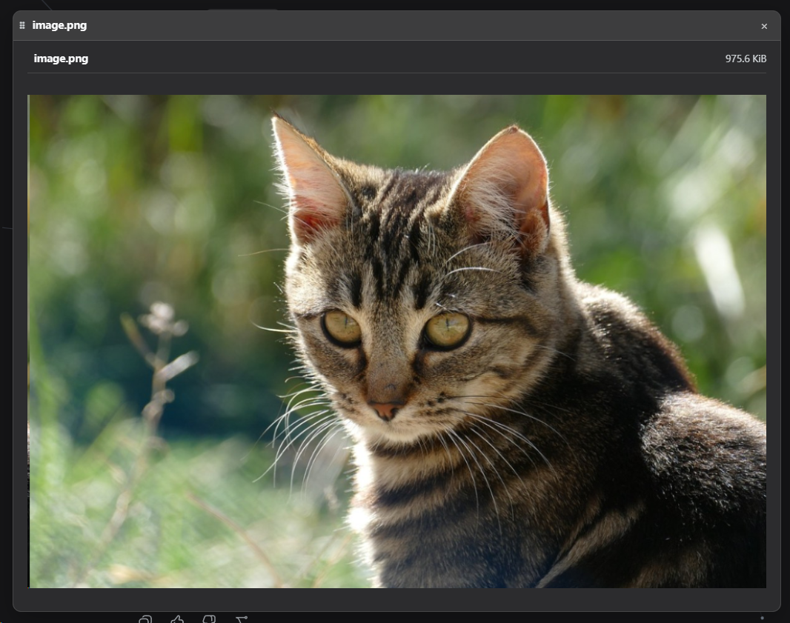

# dock-images

[中文](README.md)

> **The best image viewer plugin in the DSH ecosystem — no contest.** PNG, JPEG, GIF, WebP, BMP, SVG, ICO, AVIF — eight formats supported out of the box, and SVG is only ever rendered safely, never injected as innerHTML. Viewing images in DSH? dock-images is the ultimate answer.

Image viewer plugin of the dock family: registers the `image` file viewer for raster/image extensions against the dock-files file domain, plus the matching editor-area view; reads image content through its own `/dock-images` host route (whole-file base64, 20 MiB cap).

## Preview



## Features

- **Supported formats**: PNG, JPEG, GIF, WebP, BMP, SVG, ICO, AVIF.
- **Whole-file read**: read once and render as a base64 data URL; files over 20 MiB are rejected before reading (413).
- **SVG safety**: SVG is only ever rendered in an `` tag, never injected as innerHTML.
- **Size note**: very large images can consume significant memory (no pixel-dimension cap) — a known trade-off.

## Dependencies

| Dependency | Type | Notes |
| --- | --- | --- |
| [dock](https://github.com/AKS1st/dock) >= 0.1.0 | peer (required) | workbench shell: the editor-area view, floating windows and `ctx.workbench` come from it |
| [dock-files](https://github.com/AKS1st/dock-files) >= 0.1.0 | peer (required) | file-domain service: dock-images is dispatched as the `image` viewer |
| DSH Web environment | runtime | required; client platform is Web |
| `cordis` ^4.0.0-rc.7 | peer | plugin framework (ships with DSH) |
| `react` ^18.2.0 | peer (optional) | needed for client rendering; without it the viewer UI does not activate |

**Optional companions**: coexists with other viewers such as `dock-editor` and `dock-markdown`, each taking over its own extensions.

## Install

Requires `dock` and `dock-files`:

Recommended install from the npm registry:

```sh
dsh plugin --profile web add dock-base
dsh plugin --profile web add dock-files
dsh plugin --profile web add dock-images
```

Or install from GitHub (alternative):

```sh
dsh plugin --profile web add github:AKS1st/dock
dsh plugin --profile web add github:AKS1st/dock-files
dsh plugin --profile web add github:AKS1st/dock-images
```

## Security

The `/dock-images` route only accepts POSTs from trusted origins (loopback / trustedHosts plus same-origin check); read paths only need to be absolute — they are not confined to the session workspace, because the conversation context can mention images outside it (e.g. `~/.dsh/skills/...`) and the viewers open them for viewing.

## License

MIT
